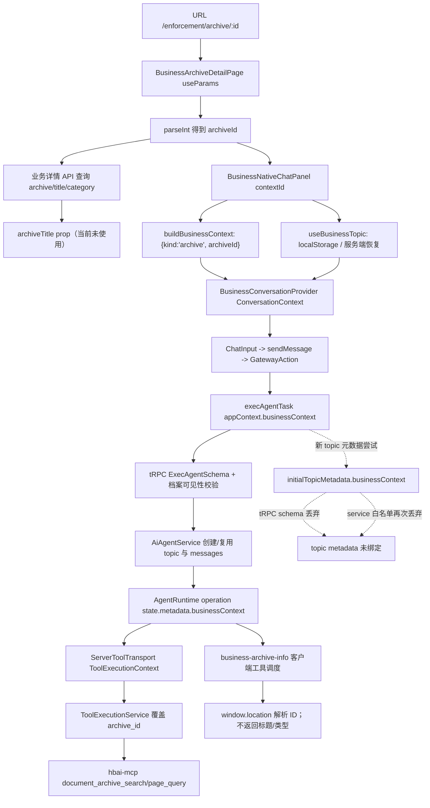
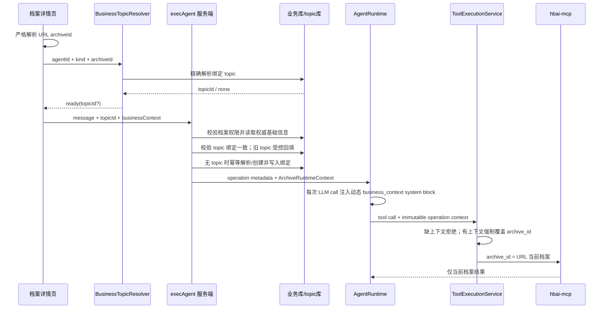

# 档案详情页右侧对话：档案上下文 ID 传递稳定性排查与改造方案

> 调研日期：2026-08-27\
> 调研范围：`lobehub` 主工程、`hbai-mcp` 独立工程\
> 当前阶段：仅调研与方案设计，不包含业务代码修改\
> 适用页面：`/enforcement/archive/{archiveId}` 右侧 “当前档案问答” 面板

## 1. 结论摘要

当前 “偶尔能识别当前档案、偶尔不能” 的现象不是单一故障，而是两类机制叠加造成：

1. **档案 ID 的工具执行约束链路已经基本接通，但不是闭环。** 页面会在每次正常发送时把 `businessContext.archiveId` 送入服务端 operation，服务端也会在执行 `document_archive_search` / `document_archive_page_query` 前覆盖模型生成的 `archive_id`。但缺少 `businessContext` 时当前逻辑直接放行，不是 fail-closed，模型仍可能使用历史或猜测出来的 ID。
2. **档案标题、类型等基础信息没有稳定进入模型上下文。** 页面取得了 `archive.title`，也传给了 `BusinessNativeChatPanel`，但面板当前没有使用该属性；运行态 `businessContext` 只含 ID。模型只能依赖工具调用结果或历史消息间接得知标题，因此工具未调用、结果被截断、长对话压缩或新会话恢复后都会丢失。
3. **“当前档案信息” 内置工具的实现与描述不一致。** manifest 声称返回标题、年份、页数等，但工具被限定为客户端执行，客户端实现只从 `window.location` 返回档案 ID。代码中虽保留了能够查数据库并返回标题等字段的服务端 runtime，但由于 manifest 是 `executors: ['client']`，正常 Gateway 路径不会使用它。
4. **最近加入的服务端 topic 恢复兜底实际未生效。** 当前至少存在三个确定性断点：前端请求 `pageSize: 200`，而 tRPC schema 最大只允许 100；`initialTopicMetadata` schema 不接收 `businessContext`；即使进入 service，新建 topic 时也只复制工作目录相关字段，仍会丢掉 `businessContext`。
5. **前端存在跨档案瞬时串话窗口。** 路由由档案 A 切到 B 时，`topicId` 在 `useEffect` 执行前仍是 A；同时没有 topic 的所有业务面板共用 `main_{agentId}_new` 消息桶，因为 `messageMapKey` 不包含 `businessContext`。快速切换、恢复未完成前发送、并发首问均可能复用错误历史或创建重复 topic。
6. **服务端没有校验 “topic 绑定档案” 和 “本次请求档案” 一致。** stale localStorage 指针或前述竞态可形成 `topic=A + businessContext=B`。此时检索会被限定到 B，但历史消息来自 A，造成语义污染和错误回答。

因此，推荐的修复不是继续依赖提示词或历史消息记住档案，而是建立三层稳定约束：

- **页面层：** URL 中的严格合法档案 ID 是每次请求的输入源，切档案时同步隔离本地状态，并在 topic 解析完成前禁止发送。
- **服务端会话层：** topic 持久绑定 `{kind:'archive', archiveId}`，发送前校验绑定一致；无绑定旧 topic 只允许受控回填，绑定冲突必须拒绝并解析正确 topic。
- **运行时层：** 服务端按 ID 查询权威档案基础信息，在每个 operation / 每次 LLM 调用中注入不可被历史压缩移除的动态系统上下文；所有档案 MCP 工具缺上下文时拒绝执行，有上下文时强制覆盖 `archive_id`。

这套方案兼容现有 Workbody / 业务 topic 会话隔离改造，不改变共享文档问答 Agent 的配置模式，也不需要为每个档案创建独立 Agent。

## 2. 调研边界与术语

### 2.1 本次涉及的两个工程

- 主工程：`/Users/dongjiming/software/tencent-cloud/lobehub`
- MCP 工程：`/Users/dongjiming/software/tencent-cloud/hbai-mcp`

### 2.2 三种不同的 “上下文”

为避免概念混淆，本文使用以下区分：

| 名称                            | 内容                                       | 生命周期           | 当前用途                            |
| ------------------------------- | ------------------------------------------ | ------------------ | ----------------------------------- |
| 业务绑定 `BusinessAgentContext` | `{ kind: 'archive', archiveId: '123802' }` | 页面 / 请求 /topic | 标识当前档案、限制工具查询范围      |
| 档案基础信息快照                | ID、标题、分类、文号、年份、页数等         | 单次 operation     | 让模型随时准确回答 “当前档案是什么” |
| 对话历史上下文                  | user/assistant/tool messages、压缩摘要     | topic              | 保持多轮语义连续性                  |

业务绑定是安全边界；基础信息是权威事实；对话历史只是模型输入，不能承担前两者的职责。

## 3. 当前源码链路

### 3.1 总体数据流



### 3.2 路由与档案详情加载

1. SPA 注册路由 `enforcement/archive/:id`。
2. `BusinessArchiveDetailPage` 使用 `useParams<{id:string}>()` 读取参数，并通过 `Number.parseInt` 得到 `archiveId`（`src/features/BusinessArchiveDetailPage/index.tsx:709-712`）。
3. 页面以该 ID 调用 `getAiArchive` 和档案页列表 API，得到 `archive.title`、`category_name/category_code`、`page_count` 等展示数据。
4. 右侧面板接收：
   - `contextId={String(archiveId)}`；
   - `archiveTitle={archive?.title}`；
   - 固定共享 `archiveAgentId`；
   - `kind="archive"`（同文件 `1461-1469`）。

风险：`parseInt('123abc', 10)` 会得到 `123`，当前不是严格的全数字校验。虽然正常路由不会主动产生此 URL，但不应把宽松解析作为安全边界。

### 3.3 面板内业务上下文构造

`buildBusinessContext` 只生成：

```ts
{ kind: 'archive', archiveId: contextId }
```

位置：`src/features/BusinessNativeChatPanel/utils.ts:15-25`。

`archiveTitle` 虽仍保留在 props 类型中，但组件解构时没有读取，因而不会进入 provider、消息、system role 或 operation。位置：

- 属性声明：`src/features/BusinessNativeChatPanel/index.tsx:33-39`
- 实际业务上下文创建：同文件 `82-84`

结论：**当前稳定透传的设计目标只有档案 ID；档案名称和类型从未进入模型的固定运行态上下文。**

### 3.4 topic 指针与消息桶

`useBusinessTopic` 当前采用：

1. localStorage key：`business-agent-topic:{kind}:{contextId}`；
2. 找不到本地指针时，拉取共享 Agent 的 topic 列表并在客户端扫描 `topic.metadata.businessContext`；
3. 首次创建 topic 后，通过 `onTopicCreated` 保存 topic ID。

主要源码：`src/features/BusinessNativeChatPanel/useBusinessTopic.ts:53-105`。

这里有五个重要事实：

- 切换 key 后使用普通 `useEffect` 才执行 `setTopicId(readTopic(storageKey))`（第 59-63 行），不是同步切换；一次 render 及用户交互窗口内仍可能携带旧 topic。
- 服务端恢复调用 `getTopics({agentId, pageSize: 200})`（第 74 行），但路由 schema 限制 `pageSize <= 100`（`apps/server/src/routers/lambda/topic.ts:484-495`），请求会校验失败，异常又被静默吞掉。
- topic 扫描仅覆盖一页；即使把 200 改成 100，超过第一页的档案会话仍无法恢复。
- 恢复期间 `topicId` 为空但输入框可发送；查询和首问创建 topic 存在竞争，可能产生重复 topic。
- localStorage key 没有 `agentId`、用户或 workspace 维度。切换共享 Agent 配置、同域切换账号 / 租户时可能命中旧指针。

此外，底层 `messageMapKey` 只使用 `scope/agentId/topicId/threadId`，完全忽略 `businessContext`。业务面板的 `scope` 固定为 `main`，因此任何尚未取得 topicId 的档案都使用同一个 `main_{archiveAgentId}_new` 桶。位置：

- provider context：`src/features/BusinessNativeChatPanel/BusinessConversationProvider.tsx:32-52`
- key 生成：`src/store/chat/utils/messageMapKey.ts:27-150`

这会造成切换档案、点 “新对话”、恢复失败时的内存消息复用，是当前跨档案随机污染的高风险来源。

### 3.5 前端发送到 tRPC

Gateway 路径把 panel 的 context 写入：

```ts
appContext: {
  businessContext: context.businessContext,
  topicId: context.topicId,
  ...
}
```

位置：`src/store/chat/slices/agentRun/actions/transports/gateway/gateway.ts:516-540`。

该路径还尝试把 `businessContext` 合入 `initialTopicMetadata`（第 493-497 行），用于服务端持久化 topic 绑定。

### 3.6 tRPC 校验、访问校验与 topic 创建

`ExecAgentSchema` 接受顶层 `appContext.businessContext`，所以每次 operation 的 ID 可以进入服务端。位置：`apps/server/src/routers/lambda/aiAgent.ts:191-223`。

服务端随后调用 `assertCanUseBusinessContext`：

- 严格按档案 ID 查询 `file_archive`；
- 要求 `visible='yes'` 且 `scope='ent'`；
- 不存在则拒绝 operation。

位置：`apps/server/src/routers/lambda/_helpers/businessContextGuard.ts:70-95`。

但 topic 元数据的持久化在 Gateway 路径中断了两次：

1. `initialTopicMetadata` 的 tRPC zod schema 只声明 `repos/workingDirectory/workingDirectoryConfig`，不声明 `businessContext`，未知字段会被剥离。
2. `AiAgentService` 创建 topic 时又只从 `initialTopicMeta` 复制上述三个工作目录字段，没有复制业务绑定（`apps/server/src/services/aiAgent/index.ts:1693-1710`）。

因此 commit 中 “`execAgentTask` writes `initialTopicMetadata` straight into metadata” 的注释与真实实现不一致。

补充：非 Gateway 的 client/heterogeneous 发送分支已经直接把 `operationContext.businessContext` 写到 `newTopic.metadata`。也就是说该缺陷与运行模式相关；生产右侧面板主要走 Gateway 时会稳定暴露。

### 3.7 operation 运行态

`AiAgentService` 创建 AgentRuntime operation 时，把 `businessContext` 写入 `appContext`；`AgentRuntimeService` 再通过 `...appContext` 放入 `state.metadata`。位置：

- `apps/server/src/services/aiAgent/index.ts:4186-4229`
- `apps/server/src/services/agentRuntime/AgentRuntimeService.ts:548-570`

所以在一次正常 operation 内，服务端工具执行层通常可以拿到正确 ID。

但 `agent_operations.app_context` 的持久化快照只保存 task/document/group/scope/sourceMessage 等字段，遗漏 `businessContext`：

- 类型：`packages/database/src/schemas/agentOperations.ts:45-52`
- 写入：`apps/server/src/services/agentRuntime/AgentRuntimeService.ts:472-483`

这不会直接破坏仍在 Redis/state 中运行的普通请求，但会削弱实例重启恢复、异步续跑、审计和问题追踪能力。

### 3.8 MCP 参数覆盖与 hbai-mcp

`ServerToolTransport` 从 `state.metadata.businessContext` 传到 `ToolExecutionContext`（`apps/server/src/modules/AgentRuntime/adapters/ServerToolTransport.ts:190-210`）。

`ToolExecutionService` 对两个档案工具执行强制覆盖：

- `document_archive_search`
- `document_archive_page_query`

位置：`apps/server/src/services/toolExecution/index.ts:30-33, 91-138`。

当上下文存在时，模型即使传入错误 `archive_id`，也会被页面当前 ID 覆盖。这部分是当前最可靠的隔离机制。

但是函数开头存在：

```ts
if (!businessContext) return { payload };
```

即缺上下文时不拒绝，而是让模型参数原样进入 MCP。结果可能是：

- 模型未传 ID，MCP 返回 “archive\_id 不能为空”；
- 模型从历史中复用旧 ID，查询错误档案；
- 模型猜测 ID，产生越界或错误查询。

`hbai-mcp` 自身对两个档案工具均要求 `archive_id > 0`，不会在空 ID 时回退全库检索，这是正确的最后防线：`hbai_mcp/app.py:383-425`。

### 3.9 “当前档案信息” 内置工具

目前存在两个实现：

1. 客户端 executor：从 `window.location.pathname` 提取数字 ID，只返回 `archive_id/kind/source/url`。位置：`src/store/tool/slices/builtin/executors/lobe-archive.ts:38-69`。
2. 服务端 runtime：使用 operation 的 `businessContext.archiveId` 查询 `file_archive`，可返回 `title/doc_no/year/page_count/category_code/company_id`。位置：`apps/server/src/services/toolExecution/serverRuntimes/archive.ts:23-83`。

manifest 设为 `executors: ['client']`（`packages/builtin-tool-archive/src/manifest.ts:21-26`），导致服务端权威实现成为不可达 / 非首选代码。客户端执行还依赖 Gateway WebSocket + Redis 工具结果等待；刷新、断线、重连和超时都会增加失败面。

同时，`RECOMMENDED_SKILLS` 只影响推荐 / 安装展示，不等于共享档案 Agent 一定已启用该工具。是否绑定工具仍需检查生产 Agent 配置。

## 4. 根因清单

### 4.1 已由源码确认的直接根因

| 编号 | 根因                                     | 触发场景                       | 结果                                      | 置信度             |
| ---- | ---------------------------------------- | ------------------------------ | ----------------------------------------- | ------------------ |
| R1   | 标题、类型未进入固定运行态上下文         | 任意提问                       | 模型只能靠历史 / 工具碰运气               | 已确认             |
| R2   | `archiveTitle` prop 当前未使用           | 页面已加载完整详情             | UI 有标题，模型仍不知道                   | 已确认             |
| R3   | 当前档案工具客户端实现只返回 ID          | 模型调用 `get_current_archive` | 无法直接回答标题 / 类型                   | 已确认             |
| R4   | 当前档案工具强制 client executor         | WS 断线、刷新、后台恢复        | 调用超时或失败，服务端权威 runtime 未使用 | 已确认             |
| R5   | 是否调用工具由模型决定                   | 同样问法、不同模型采样 / 历史  | 有时检索、有时直接回答                    | 已确认             |
| R6   | topic 恢复使用非法 `pageSize:200`        | localStorage 缺失 / 跨设备     | 服务端兜底总是进入 catch                  | 已确认             |
| R7   | Gateway topic metadata schema 丢弃绑定   | 首次创建 topic                 | 服务端无 `businessContext` 可恢复         | 已确认             |
| R8   | topic service 创建再次丢弃绑定           | 即使放开 schema                | 绑定仍不会落库                            | 已确认             |
| R9   | 路由切换后通过普通 effect 更新 topic     | A→B 后快速交互                 | 短暂使用 A 的 topic + B 的 ID             | 已确认             |
| R10  | topic 解析期间允许发送                   | 刷新 / 跨设备后立即首问        | 重复 topic、历史未恢复                    | 已确认             |
| R11  | 无 topic 的不同档案共用 `_new` 消息桶    | 新会话 / 恢复失败 / 切档案     | 内存消息跨档案复用                        | 已确认             |
| R12  | 服务端不校验 topic 绑定与请求绑定一致    | stale 指针 / 竞态              | A 历史 + B 检索结果混合                   | 已确认             |
| R13  | 档案 MCP 缺 businessContext 时放行       | 上下文链路任何一点丢失         | 空 ID、旧 ID 或猜测 ID 进入 MCP           | 已确认             |
| R14  | operation DB 快照不保存绑定              | 实例重启、异步续跑、审计       | 无法可靠恢复 / 定位本次档案               | 已确认             |
| R15  | localStorage key 缺 agent/user/workspace | 换 Agent、切账号 / 租户        | 命中过期或他域 topic 指针                 | 已确认             |
| R16  | 本地 topic 指针不做服务端归属校验        | topic 删除 / 无权 / 配置变化   | 恢复失败、错误 topic 继续使用             | 已确认             |
| R17  | “新对话” 与服务端自动恢复语义冲突        | 修好 metadata 恢复后点击新对话 | 刚清空本地指针又被旧 topic 自动找回       | 已确认（潜在回归） |

### 4.2 页面刷新、长对话及并发为何放大问题

#### 页面刷新

- localStorage 指针存在时主要依赖本地，指针若正确通常能恢复。
- 指针不存在时服务端兜底因 `pageSize` 校验失败且 metadata 未落库而失效，会以 `_new` 状态启动。
- 若上一次运行尚未结束，客户端型档案工具还依赖 Gateway 重连后才能返回结果。

#### 路由跳转

- React 可能复用同一个页面和 hook 实例。
- `businessContext` 会立刻变成 B，但 `topicId` 要等 effect 才从 A 切到 B。
- `_new` 消息桶不含档案 ID，进一步扩大交叉窗口。

#### 会话切换 / 新对话

- localStorage 是非权威指针；没有校验该 topic 是否属于当前 Agent / 用户 / 档案。
- 未来修复服务端恢复后，清空指针并不能表达 “用户明确要新建”，需要独立的 `forceNew`/generation 语义。

#### 并发请求

- 两个标签页同时首次打开同一档案，都可能在解析完成前创建 topic。
- 当前没有服务端唯一性或幂等锁；重复 topic 后客户端 `.find` 的选择依赖列表排序。
- 同一面板连续快速发送时，如果首次 topic ID 尚未回写，也可能发起多个 “无 topic” 请求。

#### 缓存 /localStorage

- localStorage 不随服务端删除、权限、Agent 配置变化自动失效。
- key 不含用户 /workspace/agent，天然存在碰撞。
- 读取 / 写入异常被静默降级，UI 没有暴露 “未恢复完成”。

#### 消息截断与上下文窗口压缩

- 当前标题若来自某次工具结果，它只是普通历史消息。
- 长对话中旧 tool result 可能不再进入模型窗口，或只剩不保证保留标题的摘要。
- 压缩不会凭空恢复从未注入的当前档案事实，因此 “之前答对、后来答不出” 符合现有实现。

#### 异步时序

- topic 列表恢复、详情 API 加载、Agent 配置加载、Gateway 建连彼此独立。
- 当前输入框没有以 “业务绑定就绪 + topic 解析完成” 作为统一发送门槛。

### 4.3 需在联调环境核验的配置风险

以下不能仅凭仓库静态源码断言生产值，但必须纳入上线前检查：

- `LOBE_BUSINESS_ARCHIVE_AGENT_ID` 是否指向预期共享 Agent。
- 该 Agent 是否实际启用了 `business-archive-info` 和 hbai-mcp 的两个档案工具；“推荐” 不等于 “启用”。
- Agent system role 是否明确要求档案问题使用档案工具，是否存在与通用搜索工具冲突的指令。
- 生产是否全部走 Gateway；若存在 client/Gateway 混合，topic metadata 的行为会不一致。
- `CASE_ARCHIVE_DATABASE_URL/CASE_ARCHIVE_DB_*`、Redis、Agent Gateway 是否健康。
- 生产 MCP 版本是否已包含 `document_archive_search`、`document_archive_page_query` 且 schema 与主工程一致。

## 5. 推荐改造方案

### 5.1 设计原则

1. URL 中的 ID 是页面输入源，但服务端数据库是档案基础信息的权威源。
2. 业务绑定不依赖模型记忆、历史消息、模型参数或客户端工具回传。
3. topic 绑定用于恢复和防串话；operation 绑定用于本次执行；两者必须一致。
4. 工具执行必须 fail-closed：缺上下文、类型不匹配、topic 不匹配时拒绝。
5. 标题 / 类型作为每次运行的动态系统上下文注入，不能只靠一次 tool result。
6. 兼容旧 topic 和现有 localStorage，但逐步降级为服务端权威、本地仅缓存。

### 5.2 目标数据模型

#### 持久会话绑定

```ts
type BusinessAgentContext = {
  kind: 'archive';
  archiveId: string;
};
```

只保存稳定主键，不把可能变化的标题长期复制进 topic metadata。

#### 单次运行权威快照

```ts
type ArchiveRuntimeContext = {
  archiveId: string;
  title: string | null;
  categoryCode: string | null;
  categoryName?: string | null;
  docNo: string | null;
  year: number | null;
  pageCount: number | null;
  kind: 'archive';
};
```

由服务端在 operation 开始时按 `archiveId` 查询，供动态 system context、内置工具和日志共用。若档案信息更新，下一个用户回合自然取得新值。

### 5.3 目标链路



### 5.4 前端改造

#### A. 严格解析与组件隔离

- 只接受 `/^\d+$/` 且转换后为安全正整数的 ID，禁止 `parseInt` 的部分匹配。
- 给业务面板或 provider 增加与 `agentId/kind/contextId` 相关的 React `key`，路由 A→B 时卸载旧实例。
- hook state 保存 `{storageKey, topicId}`，render 时只有 state.key 与当前 key 相等才允许使用 topicId；不要等待普通 effect 后才纠正。

#### B. 修复消息 map 隔离

在 `ConversationContext/messageMapKey` 中加入稳定业务 scope key，至少在 `isolatedTopic && !topicId` 时形成：

```text
main_{agentId}_business_archive_{archiveId}_new
```

不能继续让所有档案共享 `main_{agentId}_new`。

#### C. topic 解析状态机

将 `useBusinessTopic` 从 `topicId | undefined` 扩展为：

```text
idle -> resolving -> ready(existing|new) -> creating -> ready(created)
                          \-> error(retryable)
```

- `resolving/creating` 时禁用发送按钮和欢迎问题。
- 恢复失败应显示可重试状态，不能静默当作新会话。
- 首次发送只允许一个 in-flight create。
- “新对话” 设置显式 `forceNew/generation`，避免自动恢复旧 topic。

#### D. localStorage 降级为缓存

新 key 至少包含：

```text
business-agent-topic:{workspaceOrUserScope}:{agentId}:{kind}:{contextId}
```

读取后必须向服务端验证 topic 的 owner、agentId 和 business binding；验证失败则清理。旧 key 可做一次兼容迁移，不能长期作为权威来源。

### 5.5 服务端 topic 绑定改造

#### A. 直接从 `appContext.businessContext` 落库

不要绕道 `initialTopicMetadata`。创建业务 topic 时，`AiAgentService` 应直接使用已通过 guard 的：

```ts
metadata.businessContext = appContext.businessContext;
```

这样可以避免 schema 漂移和客户端嵌套字段被剥离。仍建议同步补齐共享类型和 schema，保证序列化契约完整，但权威来源应是顶层受控字段。

#### B. 新增精确解析接口

不要拉取 100/200 条 topic 后在浏览器 `.find`。增加按以下条件查询的服务端接口 / Model 方法：

- 当前 user/workspace ownership；
- `agentId`；
- `metadata.businessContext.kind='archive'`；
- `metadata.businessContext.archiveId=:id`；
- 排除已删除 / 不可用状态；
- 多条历史脏数据时按 `updatedAt DESC, id DESC` 确定性选择并记录告警。

#### C. 发送前绑定一致性校验

当请求同时带 `topicId` 和 `businessContext`：

- topic 已绑定同一档案：允许；
- topic 已绑定其他档案 / 类型：返回明确冲突错误，前端重新解析正确 topic，绝不能继续运行；
- 旧 topic 无绑定：仅在 owner、agentId、页面档案访问校验全部通过时进行一次受控回填并记录审计；否则新建 topic。

#### D. 并发幂等

推荐在 “解析或创建业务 topic” 的服务端临界区加事务级 advisory lock，lock key 由 `workspace/user + agentId + kind + contextId` 派生。锁内再次查询，存在则复用，不存在才创建。这样两个标签页同时首问也只产生一个默认 topic。

如果后续允许一个档案多 topic，则单独引入 `generation/conversationSlot`，不要取消绑定一致性校验。

### 5.6 权威档案信息注入

#### A. guard 与查询合并

将当前仅返回 void 的档案访问校验扩展为 “校验并返回归一化档案信息”，一次 SQL 同时获取：

- `id`
- `title`
- `category_code`，必要时 join 分类表得到 `category_name`
- `doc_no`
- `year`
- `page_count`

既避免一次请求重复查询，也保证工具、system context、权限判断使用同一快照。

#### B. 动态 system context

在每个 operation 创建时，把服务端快照注入系统上下文，例如：

```xml
<business_context type="archive" source="server" immutable_for_run="true">
  <archive_id>123802</archive_id>
  <title>...</title>
  <category_code>...</category_code>
  <category_name>...</category_name>
  <doc_no>...</doc_no>
  <year>...</year>
  <page_count>...</page_count>
</business_context>
```

并附加规则：

- “当前 / 本档案” 始终指该块中的档案；
- 不得用用户消息或历史中的其他 ID 覆盖；
- 内容问题必须调用档案 MCP 工具；
- 基础字段可直接按该权威块回答；
- 需要最新值时以本 operation 快照为准。

该块必须由 context engine/system role 每次 LLM call 重新注入，不能作为普通 user/tool message。这样上下文压缩、消息截断、几十轮对话都不会删除当前档案身份。

### 5.7 内置档案工具改造

- 将 `business-archive-info` 改为服务端执行（建议 `executors: ['server']`）。
- 复用上一节已校验的 `ArchiveRuntimeContext`；若没有快照，再按 `businessContext.archiveId` 查询，不从 `window.location` 取值。
- 返回 manifest 所承诺的 ID、标题、分类、文号、年份、页数等。
- 客户端 executor 可在兼容期保留但不参与业务详情页主链路，后续删除，避免 WS/Redis/ 浏览器地址成为关键依赖。
- 生产共享档案 Agent 的工具绑定做发布前配置校验；若未启用必需工具，启动 / 健康检查应告警。

动态 system context 负责 “随时知道自己是谁”，内置工具负责 “显式取得结构化基础信息”，两者职责不同，建议同时保留。

### 5.8 MCP 执行层改造

将当前逻辑改为按目标工具先判断，再读取上下文：

```text
若 apiName 是档案限定工具：
  businessContext 缺失       -> BUSINESS_CONTEXT_REQUIRED
  kind 不是 archive          -> BUSINESS_CONTEXT_MISMATCH
  archiveId 非严格合法正整数 -> BUSINESS_CONTEXT_INVALID
  否则覆盖模型入参 archive_id
```

同时：

- 保留 hbai-mcp 的 `archive_id <= 0` 拒绝逻辑作为纵深防御。
- 档案限定工具清单集中维护，并为新增 / 改名工具建立契约测试，防止漏加。
- 更理想的后续方案是在 MCP manifest/tool metadata 声明 `requiredBusinessContext: 'archive'` 和注入字段，而不是永远手工维护字符串集合；本期按最小改动可先保留集中白名单。
- 工具结果校验所有返回 page 的 `archive_id` 都等于 operation 档案 ID；发现不一致立即失败并告警，禁止把跨档案结果送入模型。

`hbai-mcp` 本期原则上无需修改检索算法；只需补契约 / 回归测试和必要的响应一致性检查。其当前空 ID 拒绝行为应保留。

### 5.9 operation 持久化与可观测性

- 扩展 `AgentOperationAppContext`，将 `businessContext` 写入 `agent_operations.app_context`。
- operation 日志至少带结构化字段：`operationId/topicId/agentId/businessKind/archiveId/contextSource/topicBindingResult`。
- 工具日志记录 `modelArchiveId`（如有）、`injectedArchiveId`、`resultArchiveIds`，但不要记录档案全文。
- 增加指标：
  - `business_context_missing_total`
  - `business_topic_binding_mismatch_total`
  - `business_topic_duplicate_total`
  - `archive_tool_result_mismatch_total`
  - `business_topic_resolve_latency_ms`
- 不再静默吞掉 topic 恢复异常；前端显示可重试，服务端形成可检索日志。

## 6. 最小改动实施顺序

### P0：必须随下一版本修复

1. 修复无 topic 业务消息桶隔离，key 加入 `kind/contextId`。
2. 修复路由切换旧 topic 瞬时残留；解析完成前禁止发送。
3. 新建 topic 直接从 `appContext.businessContext` 保存绑定。
4. 新增服务端精确 topic resolver，移除 `pageSize:200 + 客户端扫描`。
5. 增加 topic 绑定一致性校验和旧 topic 受控回填。
6. 档案工具缺上下文时 fail-closed，继续强制覆盖 `archive_id`。
7. 服务端查询档案基础信息并动态注入每次 LLM 调用。
8. 将 `business-archive-info` 切换为服务端权威执行。
9. operation DB 快照持久化 `businessContext`。
10. 补齐单元、集成、E2E 和并发回归测试。

### P1：同版本建议完成

1. advisory lock / 幂等创建，治理多标签页重复 topic。
2. localStorage 新 key 与旧 key 一次迁移。
3. 新对话 generation 语义。
4. 上下文 / 工具结果结构化日志和监控告警。
5. 扫描并治理历史重复 topic、缺绑定 topic。

## 7. 兼容与迁移策略

### 7.1 旧 topic

- localStorage 有旧指针且 topic 无绑定：服务端校验 owner + agentId + 当前档案权限后回填。
- topic 已绑定其他档案：不覆盖，拒绝并重新解析 / 创建。
- 没有本地指针、服务端也无绑定：创建当前档案 topic；旧的无绑定孤儿保留，待离线脚本 / 运营规则处理。

### 7.2 重复 topic

- resolver 确定性选择最新活跃 topic。
- 记录重复指标和候选 IDs。
- 本期不自动合并消息，避免破坏消息树；确认后可提供离线归档方案。

### 7.3 共享 Agent 变更

- 新 localStorage key 包含 agentId，因此切换 `LOBE_BUSINESS_ARCHIVE_AGENT_ID` 不会误用旧 Agent topic。
- 旧 Agent 历史仍在数据库，不删除。

### 7.4 发布兼容

- 主工程和 hbai-mcp 应在同一版本窗口验证；本方案主要 MCP 接口名不变。
- 先部署支持新旧客户端的服务端，再发布前端；服务端对缺绑定旧 topic 提供兼容回填。
- 若需回滚，topic metadata 新字段为可选 JSON，不影响旧版本读取。

## 8. 风险评估

| 风险                               | 影响                   | 缓解措施                                                      |
| ---------------------------------- | ---------------------- | ------------------------------------------------------------- |
| 动态 system context 增加少量 token | 每轮成本小幅增加       | 只注入必要基础字段，体积设上限                                |
| 标题含提示注入文本                 | 模型行为被档案标题影响 | XML / 结构化数据边界、明确其为数据非指令、转义特殊字符        |
| 旧 topic 回填错误                  | 历史与档案误绑定       | 仅允许 owner/agent/ 权限全匹配，冲突不覆盖，记录审计          |
| 多标签页竞争                       | 重复 topic             | 服务端锁内二次查询、幂等创建                                  |
| 服务端业务库不可用                 | 无法开始问答           | 明确返回 “档案上下文加载失败”，不降级为无上下文运行           |
| 分类名称需要额外 join              | 查询延迟 / 口径差异    | 与详情 API 复用同一 repository/query，缓存仅作短 TTL 优化     |
| 服务端工具切换影响普通聊天         | 非档案页面调用失败     | 工具本就只应在业务绑定会话使用；返回明确 REQUIRED 错误        |
| topic metadata JSON 查询性能       | topic 多时恢复变慢     | 先加合适 JSON/expression index；后续可演进为结构化列          |
| 历史摘要含旧档案名称               | 模型同时看到新旧事实   | system context 明确当前快照最高优先级；绑定冲突禁止复用 topic |

## 9. 测试验证清单

### 9.1 URL 与页面状态

- `/enforcement/archive/123802` 解析为字符串绑定 `123802`。
- 空 ID、0、负数、`123abc`、超大非安全整数均不可启动问答。
- A→B 路由跳转当帧不展示 A 消息、不保留 A topicId。
- topic resolving/creating 时输入框和欢迎问题不可发送。

### 9.2 基础信息稳定性

- 新会话第一问 “当前档案标题 / ID / 类型是什么” 无需依赖历史即可正确回答。
- 连续重复 20 次，结果完全一致。
- 进行 50+ 轮对话并触发上下文压缩后再次询问，仍准确。
- 档案标题更新后开启下一回合，按约定取得最新数据库值。
- 标题含 XML、Markdown、引号及类似指令文本时不会影响系统规则。

### 9.3 topic 隔离与恢复

- 档案 A、B 使用不同 topic 和不同 `_new` 消息桶。
- 刷新后恢复同一 topic。
- 清 localStorage 后由服务端精确恢复。
- 另一设备登录后恢复。
- 超过 100/200 个 Agent topics 后仍能精确恢复目标档案。
- 更换共享 Agent ID 后不命中旧 Agent topic。
- 切换账号 /workspace 后不命中上一主体指针。
- topic 被删除、无权限、Agent 不匹配时清理缓存并正确处理。
- 点击 “新对话” 不会立刻自动恢复旧 topic。

### 9.4 并发与竞态

- 两个标签页同时首次打开同一档案并发送，只产生一个默认 topic。
- 首次请求未返回前连续点击发送，不产生两个 topic。
- A 的请求进行中切到 B，A 的 tool event 不写入 B 消息桶。
- Gateway 重连、刷新、慢网络下绑定不变。

### 9.5 服务端绑定防线

- `topic=A + context=A` 成功。
- `topic=A + context=B` 在运行前被拒绝，MCP 不被调用。
- 旧无绑定 topic 在全部校验通过时只回填一次。
- 无 `businessContext` 调用档案 MCP 返回 `BUSINESS_CONTEXT_REQUIRED`。
- `kind=enterprise` 调用档案 MCP 返回 `BUSINESS_CONTEXT_MISMATCH`。
- 模型传 `archive_id=B`，operation 为 A 时，MCP 实际收到 A。
- MCP 返回任一 B 页面时结果被拒绝并告警。

### 9.6 MCP 契约

- `document_archive_search` 与 `document_archive_page_query` 均拒绝 0 / 空 ID。
- 查询结果所有 `pages[].archive_id` 等于请求 ID。
- 空结果返回 “当前档案未检索到”，不回退全库。
- 工具改名 / 新增时契约测试提示未声明业务上下文策略。

### 9.7 故障演练

- 业务数据库不可用：问答拒绝启动且错误可观察。
- Redis 不可用：服务端档案基础信息仍不依赖 client-tool round trip。
- Agent Gateway 暂断：恢复后不改变档案绑定。
- hbai-mcp 超时：提示检索失败，但仍能正确回答当前档案 ID / 标题等基础字段。
- operation 实例重启 / 异步续跑：可从持久化 appContext 还原绑定。

### 9.8 回归范围

- 普通 Agent/topic 不增加业务绑定要求。
- 企业详情页现有 `BusinessNativeChatPanel` 行为不被档案专属逻辑破坏；通用 resolver 应同时支持 enterprise。
- 主聊天 active topic 不被右侧 isolated panel 劫持。
- 工具调用过程、引用跳页、消息落库、流式回答、停止 / 重试 / 重新生成正常。
- 移动端与 desktop 两份路由配置行为一致。

## 10. 建议新增自动化测试位置

- `src/features/BusinessNativeChatPanel/useBusinessTopic.test.tsx`
  - key 切换、解析状态、错误、forceNew、stale localStorage。
- `src/store/chat/utils/messageMapKey.test.ts`
  - 两个 archive 的 topicless key 不相同。
- `src/store/chat/slices/agentRun/actions/__tests__/gateway.test.ts`
  - appContext 透传、业务 metadata 创建。
- `apps/server/src/routers/lambda/__tests__/aiAgent.test.ts`
  - schema、权限、topic binding mismatch。
- `apps/server/src/services/aiAgent/__tests__/execAgent.businessContext.test.ts`
  - 新 topic 落绑定、旧 topic 回填、动态系统上下文、并发解析。
- `apps/server/src/services/toolExecution/__tests__/index.test.ts`
  - 缺上下文拒绝、类型冲突、覆盖模型 ID、结果 ID 校验。
- `apps/server/src/services/toolExecution/serverRuntimes/__tests__/archive.test.ts`
  - 服务端权威基础信息。
- E2E：档案 A/B 切换、刷新、清缓存、长会话和多标签页。
- `hbai-mcp`：两个档案工具的 ID 必填、过滤与返回一致性测试。

## 11. 上线与验收建议

### 11.1 发布前门槛

- 所有 P0 项完成并通过自动化测试。
- 在预发使用与生产同配置的共享档案 Agent、MCP、Gateway、Redis、业务库联调。
- 抽查至少 20 个不同类型档案，覆盖无标题 / 无分类 / 多页 / 超长标题。
- 验证生产 Agent 已绑定必需工具，工具名称与注入清单一致。
- 准备重复 topic 和缺绑定 topic 的只读盘点脚本 / 报表。

### 11.2 灰度指标

- 当前档案基础信息问答正确率 100%。
- `business_context_missing_total = 0`（业务详情页请求）。
- `business_topic_binding_mismatch_total = 0`；若非 0 必须能定位为旧脏数据或客户端版本。
- `archive_tool_result_mismatch_total = 0`。
- 刷新 / 跨设备 topic 恢复成功率接近 100%，失败必须有明确原因而非静默新建。
- 同一用户 / Agent / 档案默认活跃 topic 不出现新增重复。

### 11.3 回滚

- 新 metadata 字段保持可选，旧版本可忽略。
- 服务端先兼容旧客户端的顶层 `businessContext` 请求格式。
- 不在首次发布自动删除 / 合并历史 topic，降低不可逆风险。
- 若动态上下文注入出现问题，可通过服务端开关关闭展示字段注入，但不应关闭 topic 一致性与 MCP fail-closed 防线。

## 12. 最终建议

本问题不应通过 “加强提示词”“把档案标题再发一遍” 或 “让模型每次先看历史” 解决。这些方案都受模型选择、上下文窗口和消息压缩影响，无法提供业务要求的确定性。

建议评审通过后按 P0 顺序实施：先修复前端消息 /topic 隔离与服务端 topic 绑定，再加入服务端权威档案快照和动态系统上下文，最后收紧 MCP fail-closed 与补齐 operation 持久化。完成后，URL ID、topic 绑定、operation 快照、工具入参四处将形成可校验的一致链路，才能保证刷新、多轮、长对话、跨设备和并发情况下始终识别同一当前档案。
